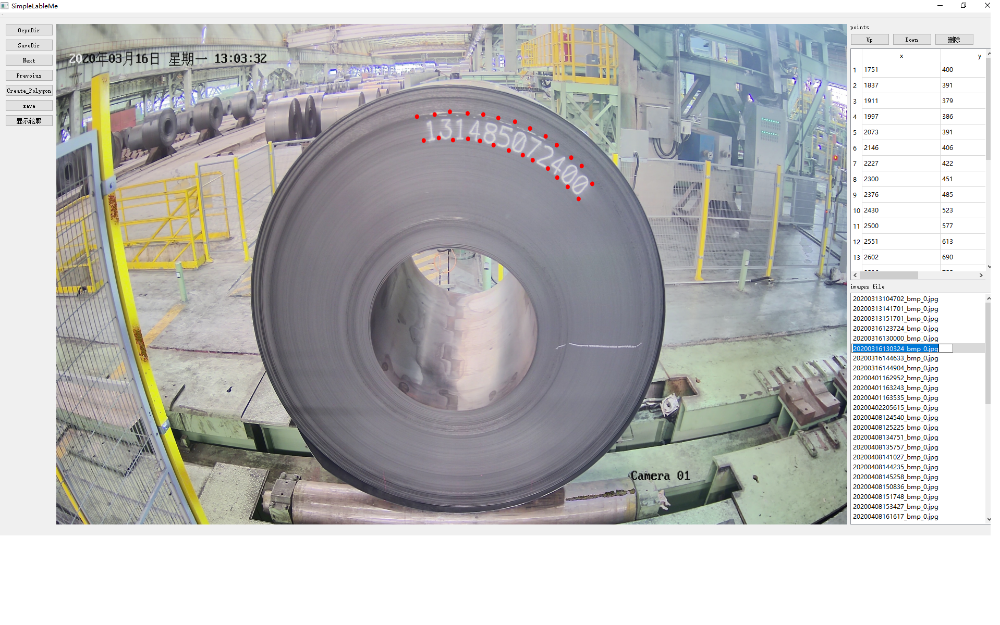

# Simple LabelMe
use qt to degin a  software for label image

## Usage

### image path

You can set image directory once by button image.

### xml saving path once by button xml

you can 

## Dependencies
This package depends on qt opencv

